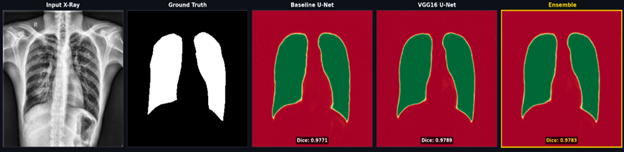
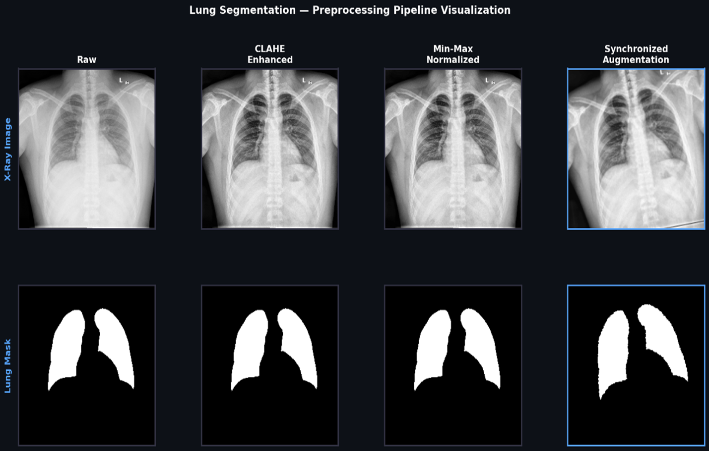
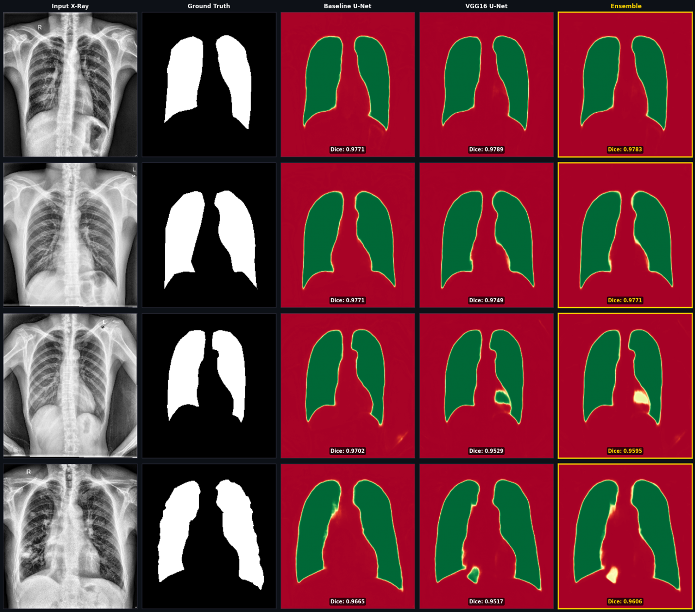
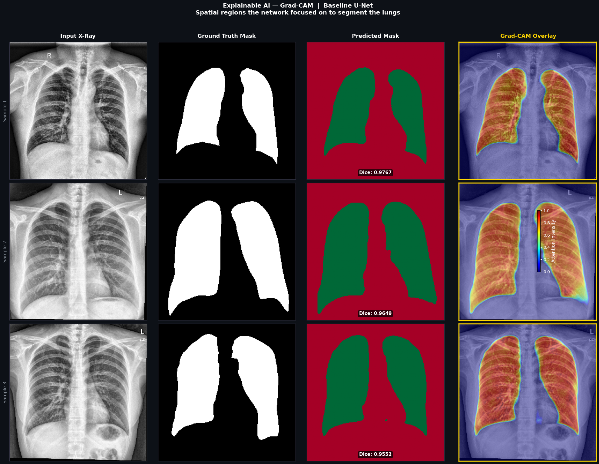
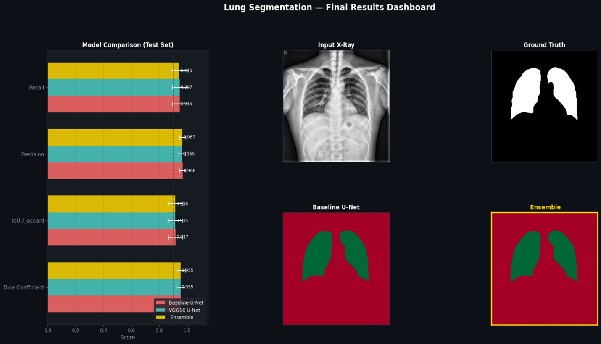

# Lung Segmentation from Chest X-Rays using Deep Learning

### Automatic Medical Image Segmentation with U-Net, Transfer Learning, Ensemble Learning & Explainable AI


This project presents a complete deep learning pipeline for **automatic lung segmentation from chest X-ray (CXR) images**. Two semantic segmentation models—a **Classic U-Net** and a **VGG16 Transfer Learning U-Net**—were implemented, compared, and further enhanced using **ensemble learning**. To improve model transparency, **Grad-CAM Explainable AI** was applied to visualize the image regions influencing the model's predictions.

---

# Overview

Medical image segmentation is a fundamental task in computer-aided diagnosis, enabling accurate localization of anatomical structures for disease analysis.

This project automates lung segmentation through an end-to-end workflow including:

* Image preprocessing
* Data augmentation
* Semantic segmentation
* Transfer learning
* Ensemble learning
* Explainable AI
* Performance evaluation
* Visualization dashboard

---

# Highlights

* End-to-end medical image segmentation pipeline
* Classic U-Net implementation from scratch
* VGG16 Transfer Learning U-Net
* Ensemble Learning
* Grad-CAM Explainable AI
* CLAHE image enhancement
* Automated preprocessing pipeline
* TensorFlow/Keras implementation

---

# Screenshots

## Sample Chest X-ray & Ground Truth



---

## Image Preprocessing Pipeline



---

## U-Net Prediction Results



---

## Grad-CAM Explainability



---

## Final Results Dashboard



---

# Key Features

## Image Preprocessing

The preprocessing pipeline automatically performs:

* Grayscale image loading
* Image resizing (256×256)
* CLAHE contrast enhancement
* Min-Max normalization
* Binary mask processing

---

## Data Augmentation

Training images are augmented using:

* Horizontal Flip
* Random Rotation
* Random Zoom
* Brightness Adjustment

---

## Deep Learning Models

### Classic U-Net

* Encoder-Decoder Architecture
* Skip Connections
* Built completely from scratch

### VGG16 Transfer Learning U-Net

* ImageNet pretrained encoder
* Frozen feature extractor
* Custom decoder

---

## Ensemble Learning

Predictions from both models are combined through weighted averaging to improve segmentation robustness.

---

## Explainable AI

Grad-CAM is used to visualize the regions responsible for the model's predictions, helping verify that the network focuses on anatomically meaningful lung structures.

---

# Dataset

**Dataset**

Lung Segmentation from Chest X-Ray Dataset (Kaggle)

Dataset Statistics

| Item       |   Value |
| ---------- | ------: |
| Images     |     704 |
| Masks      |     704 |
| Resolution | 256×256 |
| Training   |     563 |
| Validation |      70 |
| Testing    |      71 |

---

# Results

| Model         |       Dice |        IoU |  Precision |     Recall |
| ------------- | ---------: | ---------: | ---------: | ---------: |
| Classic U-Net | **0.9560** | **0.9173** | **0.9682** | **0.9459** |
| VGG16 U-Net   |     0.9547 |     0.9147 |     0.9646 |     0.9471 |
| Ensemble      |     0.9554 |     0.9161 |     0.9674 |     0.9457 |

---

# System Workflow

```text
Dataset
      │
      ▼
Image Preprocessing
      │
      ▼
Data Augmentation
      │
      ▼
Classic U-Net
      │
      ├──────────────┐
      ▼              ▼
VGG16 Transfer   Model Evaluation
Learning U-Net       │
      │              ▼
      └──────► Ensemble Learning
                    │
                    ▼
             Grad-CAM Explainability
                    │
                    ▼
            Final Segmentation Results
```

---

# Technologies Used

## Deep Learning

* TensorFlow
* Keras

## Computer Vision

* OpenCV

## Data Processing

* NumPy
* Pandas

## Visualization

* Matplotlib

## Machine Learning

* Scikit-learn

---

# Requirements

* Python 3.12+
* TensorFlow
* OpenCV
* NumPy
* Pandas
* Matplotlib
* Scikit-learn

---

# Installation

## Clone Repository

```bash
git clone https://github.com/ahadbuilds/lung-segmentation-cxr.git

cd lung-segmentation-cxr
```

## Install Dependencies

```bash
pip install -r requirements.txt
```

## Launch Notebook

```bash
jupyter notebook
```

Open:

```text
notebook.ipynb
```

---

# Workflow

### Step 1

Load Dataset

### Step 2

Image Preprocessing

### Step 3

Data Augmentation

### Step 4

Classic U-Net Training

### Step 5

VGG16 Transfer Learning

### Step 6

Model Evaluation

### Step 7

Ensemble Learning

### Step 8

Grad-CAM Explainability

### Step 9

Prediction Visualization

---

# Future Improvements

* Attention U-Net
* ResUNet
* UNet++
* TransUNet
* Multi-class segmentation
* Fine-tuning pretrained encoder
* Larger public medical datasets

---

# Learning Outcomes

This project demonstrates practical implementation of:

* Medical Image Segmentation
* Computer Vision
* Deep Learning
* Transfer Learning
* Ensemble Learning
* Explainable AI
* Image Preprocessing
* Model Evaluation

---

# Acknowledgements

* Kaggle Lung Segmentation Dataset
* TensorFlow
* Keras
* U-Net (Ronneberger et al.)
* VGG16 (Simonyan & Zisserman)
* Grad-CAM (Selvaraju et al.)

---

# License

This project is intended for educational, research, and portfolio purposes.

---

# Lung Segmentation from Chest X-Rays

**Applying Deep Learning to improve medical image analysis through semantic segmentation and explainable AI.**
